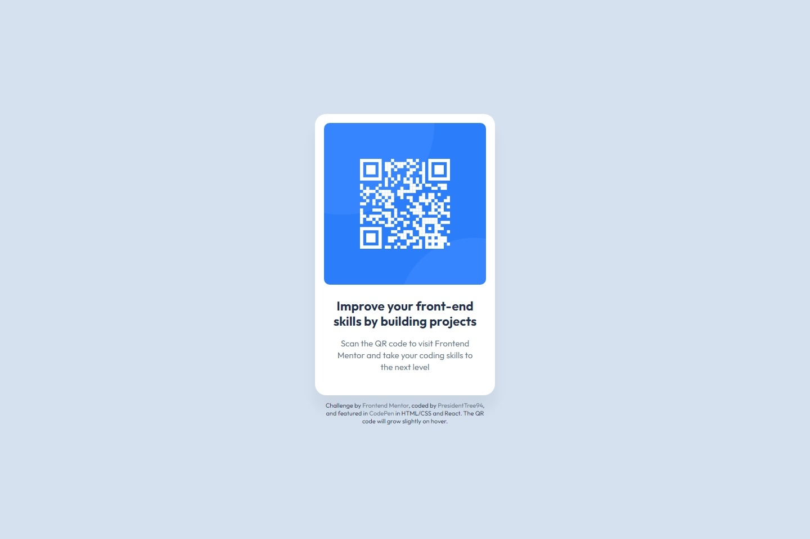

# Frontend Mentor - QR code component solution

This is a solution to the [QR code component challenge on Frontend Mentor](https://www.frontendmentor.io/challenges/qr-code-component-iux_sIO_H). Frontend Mentor challenges help you improve your coding skills by building realistic projects. 

## Overview

As part of the [Getting started on Frontend Mentor](https://www.frontendmentor.io/learning-paths) learning pathway, it is the first of four challenges users must complete to finish the unit.

### Screenshot

### Links

- Solution URL: [Frontend Mentor Solution Page](https://www.frontendmentor.io/solutions/qr-code-component-xixkp7hzyW)
- Live Site URL: [GitHub Page](https://presidenttree94.github.io/qr-code-component/)

## Author

- GitHub Profile: [PresidentTree94](https://github.com/PresidentTree94)
- Frontend Mentor Profile: [PresidentTree94](https://www.frontendmentor.io/profile/PresidentTree94)
